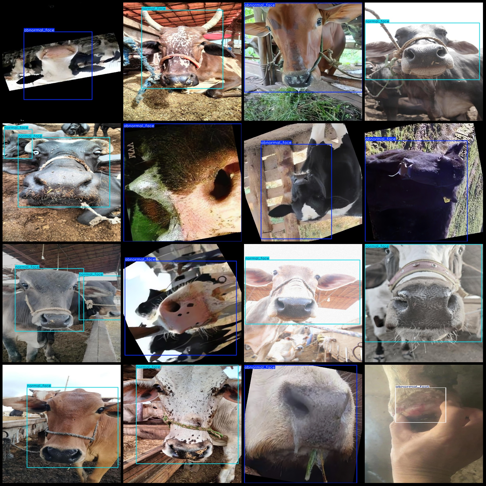
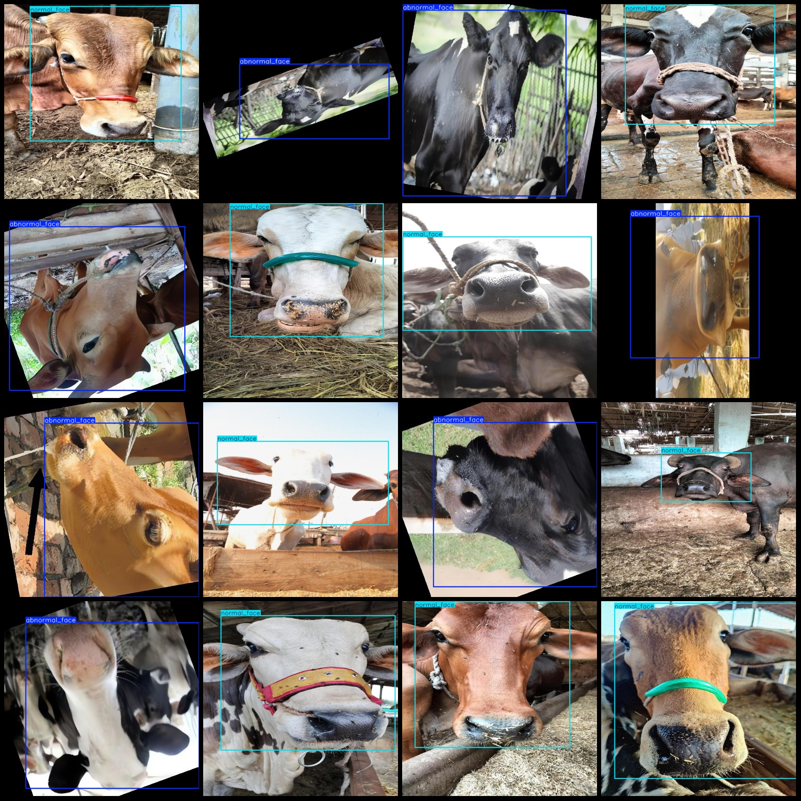

# Smart Farming Data Set for Bovine Foot and Mouth Disease Detection - Pascal VOC + YOLO Format

The dataset contains 918 images of bovine foot and mouth diseases, with a relatively small number of images labeled as facial diseases. Therefore, the majority of enhanced images focus on normal 
facial and foot conditions without enhancement.

The format of the dataset includes only JPG images, along with corresponding VOC format XML files and YOLO format txt files. The image count (in jpg files) is 918, the annotation count (in xml files) 
is 918, and the annotation count (in txt files) is also 918.

The number of annotation categories is 3: "abnormal_face", "abnormal_foot", and "normal_face".

Each category has a specified number of bounding boxes:
- abnormal_face = 526
- abnormal_foot = 34
- normal_face = 390

Total bounding box count = 950

The number of images per category is as follows:
- abnormal_face = 517
- abnormal_foot = 27
- normal_face = 374

Image resolutions include various multi-resolution images such as 600x600, 626x457, etc.

Annotation tools used are labelImg, and the annotation rules involve drawing bounding boxes for each category.

Important notes: The dataset does not have been split into training, validation, or test sets; users must do this themselves.

Special notice: This dataset does not guarantee the accuracy of models or weight files trained on it.

Image previews:

Annotation examples:

## Images

Here is a pay link on Stripe ( https://buy.stripe.com/3cs8yP7sY87d0vu9AB ). Please contact me lonlonago@foxmail.com after funding $89, and I will send you a complete data files , thank you!

